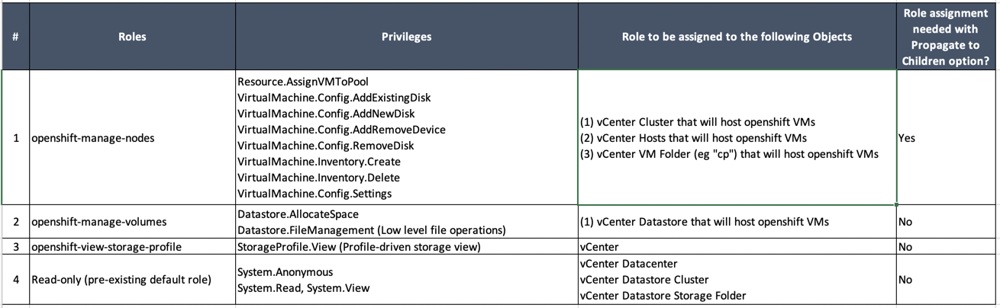
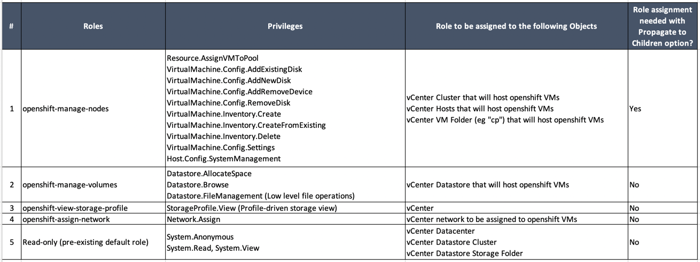

# VMware vSphere privileges required to deploy Openshift
1. Create a new vcenter user to be dedicated for Openshift.
2. Create a new "virtual machines & templates folder" and give it a name (eg "cp"). Folder name should match the cluster name defined by "metadata.name" property in "install-config.yaml" config file. it will also be part of the cluster FQDN (".<metadata.name>.<baseDomain>") 
3. Assign the below roles to the Openshift user scoped to the mentioned objects. 
## Privileges required to provision dynamic persistent volumes on vSphere datastores:
Privileges are included in this [excel sheet](./openshift-vcenter-privileges.xlsx) for easier sharing with the client
<kbd></kbd>
## Additional Privileges to be assigned to the vCenter user who will provision openshift virtual machines (UPI):
The following table covering both privileges needed to provision openshift virtual machines as well as dynamic persistent volumes provisioning.
<kbd></kbd>
